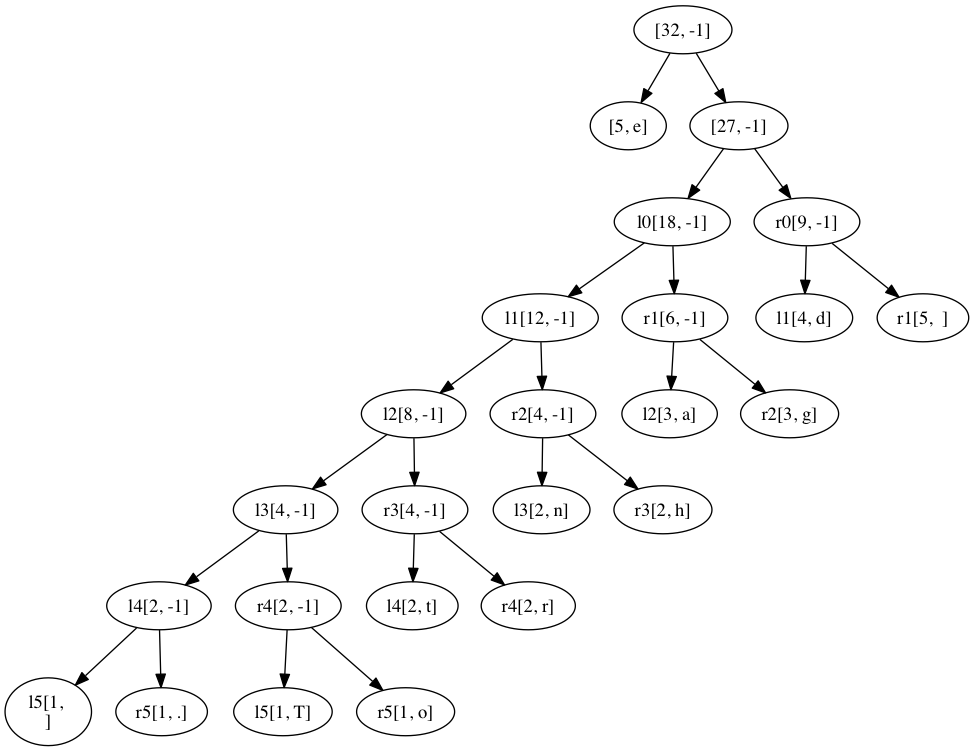

## Huffman Coding

Yesterday, we talked about losslessly compressing text via Huffman coding. This technique assigns different encodings to characters based on the frequency of occurrence in a given text.

You can find an example of this [here](https://www.siggraph.org/education/materials/HyperGraph/video/mpeg/mpegfaq/huffman_tutorial.html).

#### Your task

Write a program that reads a given file and builds a Huffman tree for the file. Given the string:

`The dog gandered at the gander.`

The tree looks like this:

# Requirements: (max B+)
1. Create a Comparable Node subclass for Huffman encoding
   * contains a char and a frequency.
   * isLeaf- returns true if the given node is a leaf
   * compareTo- compares frequency of the nodes to determine greater than less than or equal.
2. read in a file, create a priority queue of nodes, loops through priority queue to create Huffman Tree
3. print the tree (make a toString() that encodes the tree in 'binary' like the linked example above)

# Challenge Options: (one = max A, two = max A+) 
4. Print the compression rate compared to a typical 8bits per character representation of the original file.
5. Make a binary encoding of the original file using the tree and save it to a new file (include the binary tree in the file as well).
6. Make a Static method that 'unzips' a given huffman compressed file, assuming the tree is encoded properly and included in the file, then saves the uncompressed text in a file.

